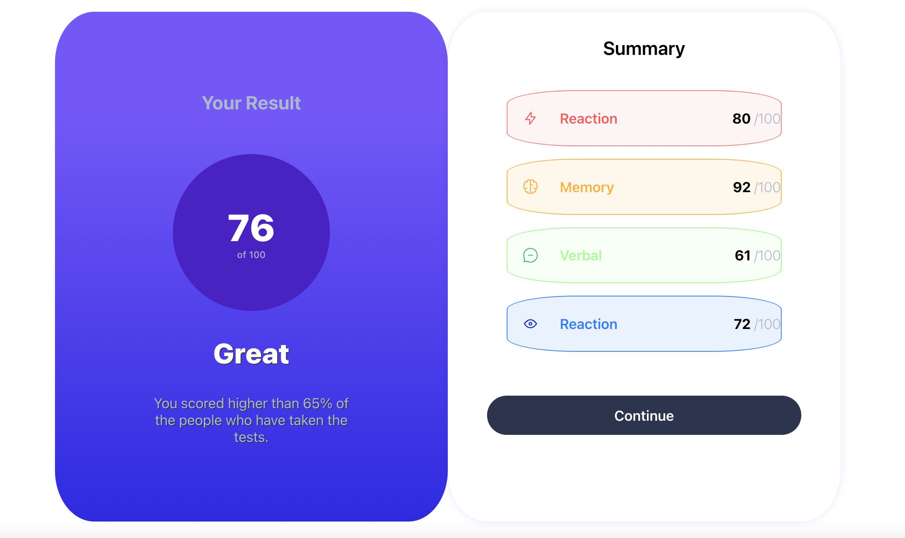
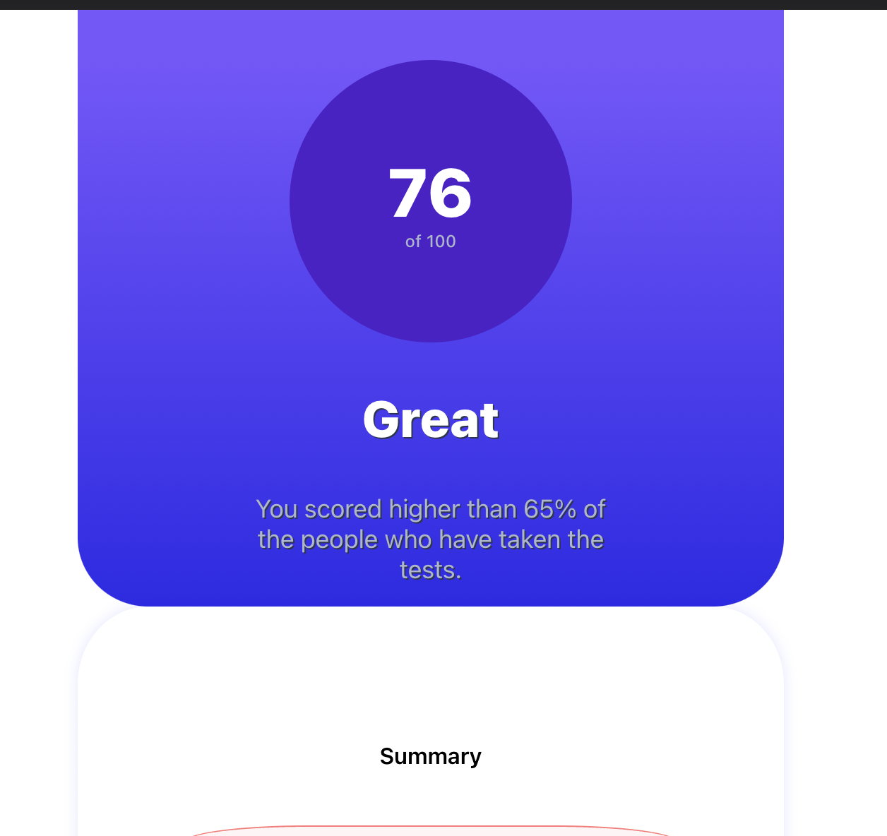
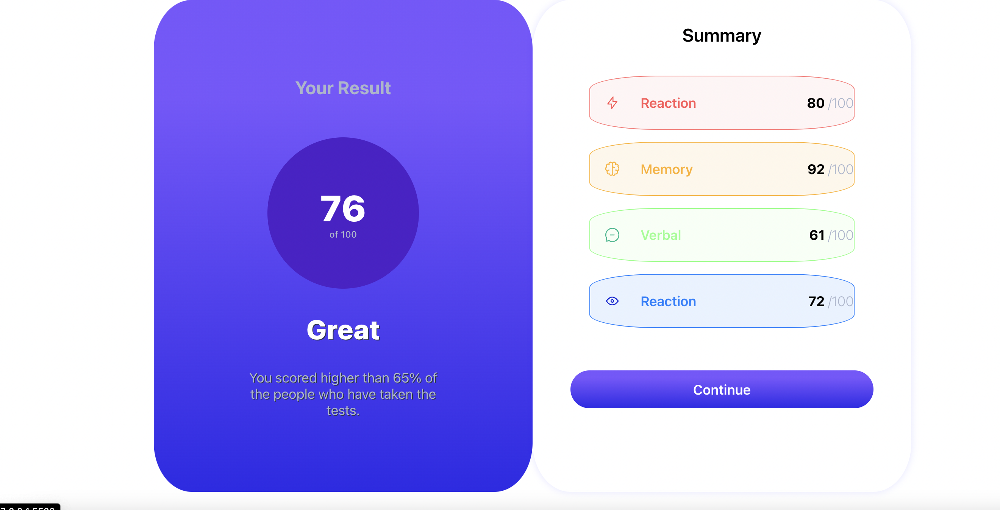

# Frontend Mentor - Results summary component solution

This is my solution to the [Results summary component challenge on Frontend Mentor](https://www.frontendmentor.io/challenges/results-summary-component-CE_K6s0maV). Frontend Mentor challenges help improve coding skills by building realistic projects. 

## Overview

### The challenge

Users should be able to:

- View the optimal layout for the interface depending on their device's screen size
- See hover and focus states for all interactive elements on the page

### Screenshot
#### Desktop View

#### Mobile View

#### Active State


### Links

- Solution URL: (https://your-solution-url.com)

## My process

### Built with

- Semantic HTML5 markup
- CSS custom properties
- Flexbox
- CSS Grid
- Mobile-first workflow

### What I learned

During this project, I learned how to use CSS Grid to create a responsive layout for the results summary component. I also improved my skills in using Flexbox for positioning elements and CSS custom properties for managing colors and other styles.

Here's an example of the CSS code I'm proud of:

```css
.card-summary-section {
   @media (max-width: 767px) {
    .card-div {
      display: flex;
      flex-direction: column;
      align-items: center;
      justify-content: center;
      width: 100%;
      height: 100%;
      margin: 0 auto;
      box-sizing: border-box; 
    }
  
    .card-summary-section,
  .card-result-section {
    width: 80%;
  }
  
    .card-summary-section {
      order: 2;
      height: auto;
    }
  
    .card-result-section {
      order: 1;
      height: auto;
      margin-bottom: 0;
    }
  
    .card-summary-header {
      font-size: 16px;
      margin-top: 5rem;
    }
  
    .card-item-header {
      font-size: 12px;
      margin-right: 1rem;
      width: 60%;
    }
  
    .card-item-icon {
      width: 10%;
      height: 10%;
      border-radius: 10%;
    }
    .card-item-score{
      font-size: 12px;
    }
    .card-item-score-not-bold{
      font-size: 12px;
    }
  }
}
```
This code snippet demonstrates the CSS styles for a responsive card component (card-summary-section). It utilizes a media query to adapt to screens with a maximum width of 767 pixels.

Inside the media query, the card's layout is adjusted for smaller screens. The card-div element becomes a flex container with a column direction, allowing items to stack vertically.

The card-summary-section and card-result-section are set to a width of 80% to maximize space usage. The card-summary-section has an order of 2 to appear below card-result-section.

Typography adjustments include smaller font sizes for card-summary-header and card-item-header. The card-item-header has a margin-right of 1rem and a width of 60% to provide spacing and enable text wrapping.

The card-item-icon has a circular shape with a width and height of 10% and a border radius of 10%.

card-item-score and card-item-score-not-bold have smaller font sizes for better readability.

This code snippet serves as a reference for creating responsive card components.

## Continued development

In future projects, I would like to continue focusing on improving my skills in responsive design and creating more complex layouts using CSS Grid and Flexbox. I also want to explore more advanced CSS techniques and animations to enhance the user experience. I want to also create a method for development as this was my first project, so once I got to writing alot of code I got so lost, about where stuff is going wrong, this is a very rough solution

## Useful resources
CSS Grid Guide (https://your-solution-url.com) - A comprehensive guide to CSS Grid layout (https://your-solution-url.com) - which helped me understand and implement the responsive grid in this project.
Flexbox Guide (https://your-solution-url.com) - A useful resource that explains how to use Flexbox for positioning elements in a flexible and responsive way.
Author
Frontend Mentor - @yourusername
Twitter - @yourusername


